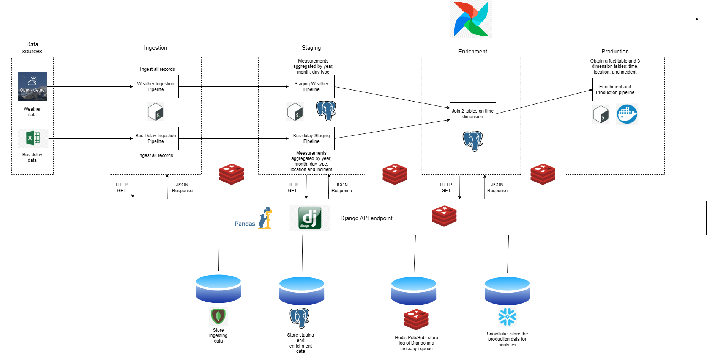
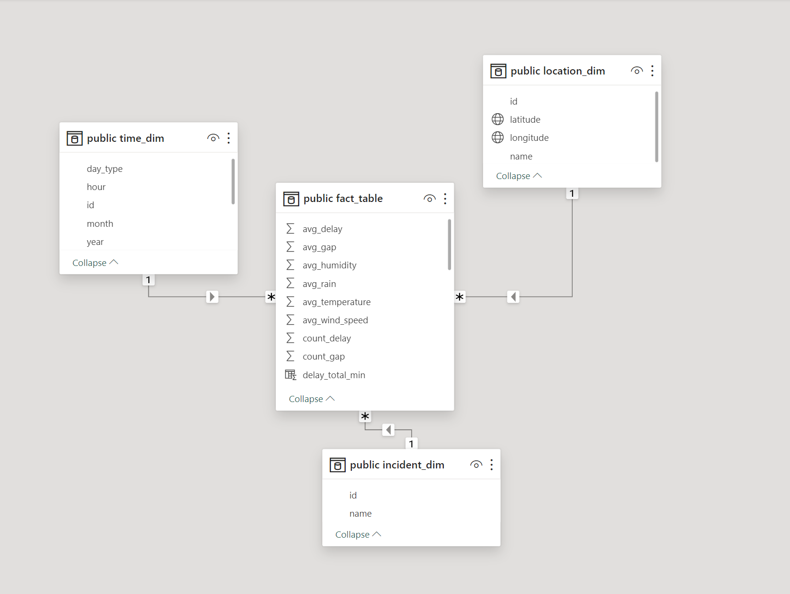
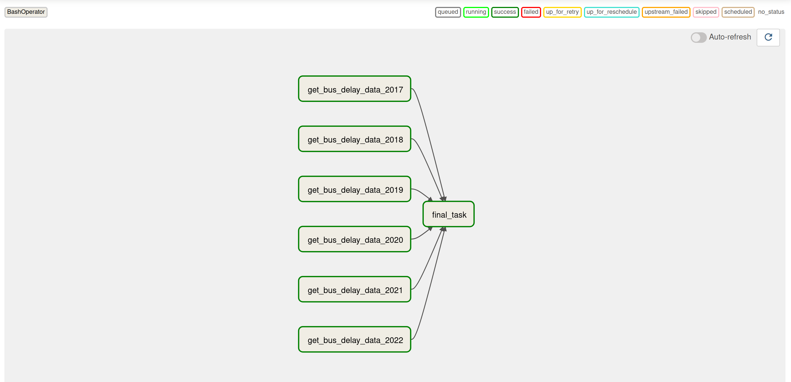
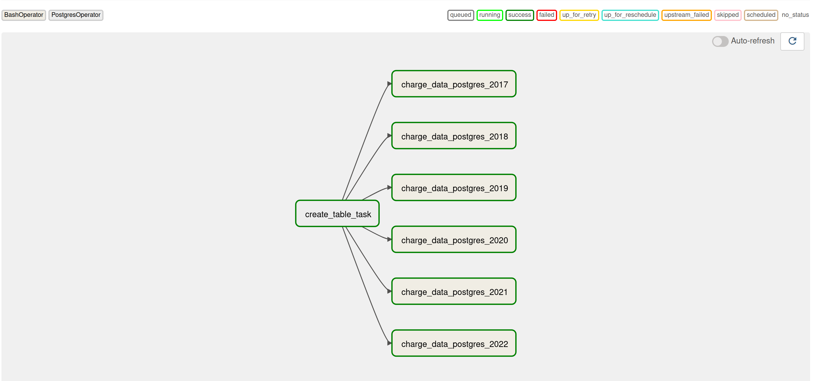
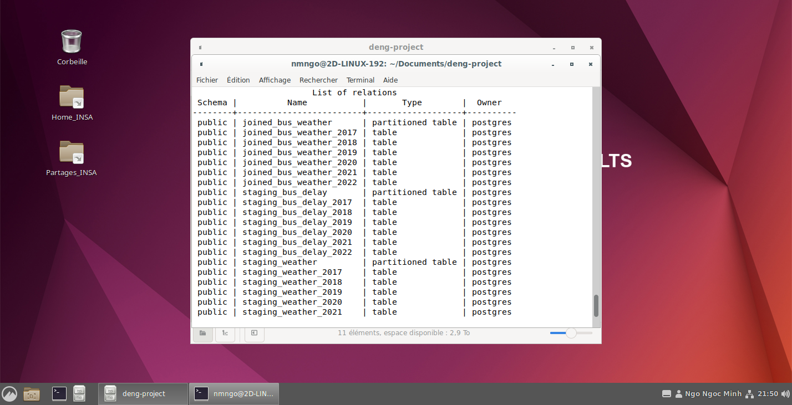
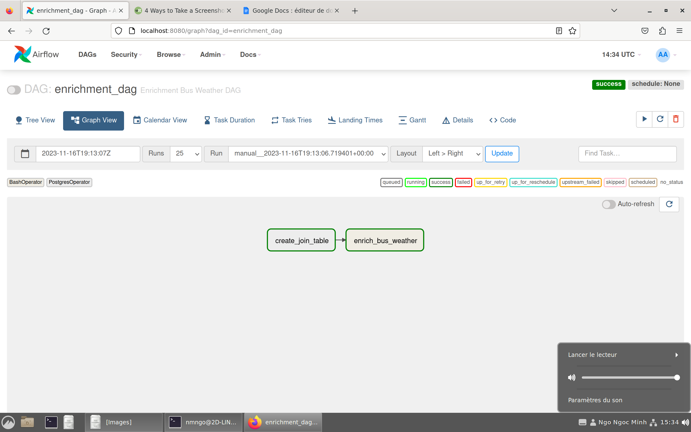
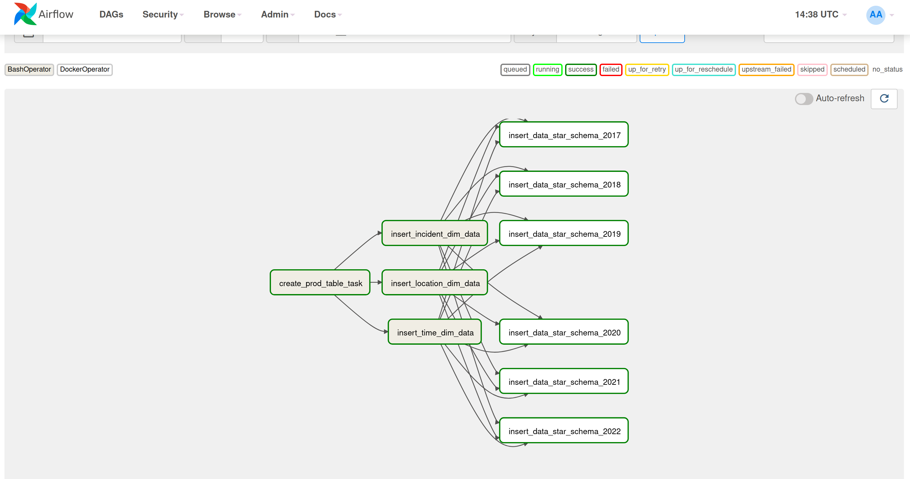

# Project Meteorif
## Table of Contents
- [Project Meteorif](#project-meteorif)
  - [Table of Contents](#table-of-contents)
- [Introduction](#introduction)
- [Architecture](#architecture)
  - [Airflow](#airflow)
  - [Pipeline API](#pipeline-api)
  - [Star Schema](#star-schema)
- [Pipelines](#pipelines)
  - [Ingestion](#ingestion)
  - [Staging](#staging)
  - [Enrichment](#enrichment)
  - [Production](#production)
- [Presentation](#presentation)
- [Future development](#future-development)
- [Project Submission Checklist](#project-submission-checklist)
- [How to run](#how-to-run)
  - [Automated](#automated)
  - [Manual](#manual)
- [Contact](#contact)
- [Acknowledgements](#acknowledgements)

# Introduction
This project is part of the Foundation of Data Engineering course in [INSA Lyon](https://www.insa-lyon.fr/en/). 
The goal of this project is to build multiple data pipelines to process weather data and bus delay time in Toronto data from 2017 to 2022 and make it available for analysis.

# Architecture
The architecture of this project is shown in the figure below. The data is ingested from two sources : the [Toronto Open Data](https://open.toronto.ca/) and [Open Meteo](https://open-meteo.com/en/docs). The data is then processed by the data pipeline and available for analysis.



## Airflow
The data pipeline is built using [Apache Airflow](https://airflow.apache.org/) and the [DAG](https://airflow.apache.org/docs/apache-airflow/stable/concepts.html#dags) concept in Airflow. The DAGs are defined in the `dags` folder.

## Pipeline API
Pipeline API is a Restful API that is built using [Django](https://www.djangoproject.com/) and [Django Rest Framework](https://www.django-rest-framework.org/). The API is used to trigger the data pipeline and to get the status of the data pipeline. The API is defined in the `pipeline_api` folder.
API Documentation can be found [here](https://github.com/5IF-Data-Engineering/pipeline-api/blob/main/README.md#api-documentation). We use [Django](https://www.djangoproject.com/) and [Django Rest Framework](https://www.django-rest-framework.org/) because we want to structure the code in another service
than Airflow. Django service is exposed on port 8000.

## Star Schema
The data is stored in a Data Warehouse in [Snowflake](https://www.snowflake.com/), is defined in the `star_schema` folder,
and is shown in the figure below.



# Pipelines
The data pipeline is divided into 4 stages: Ingestion, Staging, Enrichment, and Production.

## Ingestion
The bus delay time data is ingested from  6 Excel spreadsheets from [Toronto Open Data](https://open.toronto.ca/). We use [Pandas](https://pandas.pydata.org/) to read the Excel spreadsheets. When the data is ingested, 
the Json Response is also stored in the Redis database to speed up the data pipeline. We divide also the data by year to speed up the data pipeline. The data pipeline is shown in the figure below.



Each year, we divide the bus data into 4 parts: January to March, April to June, July to September, and October to December. Each part is then processed in parallel. Inside each task, we consider that small ETL pipelines are executed. The small ETL pipelines are triggered by
the API call, defined inside the BashOperator of the DAG. Each BashOperator will execute a Shell script to process the data. The Shell script is defined in the `./airflow/scripts` folder.
Inside each small ETL pipeline defined inside the `pipeline_api`, the data is extracted from [Open Meteo API](https://open-meteo.com/en/docs), then transformed using Pandas, and finally loaded into the MongoDB database. We choose the MongoDB database for the ingestion stage because it is a NoSQL database : it has many advantages as flexiblity and is schemaless, which is suitable for storing the raw data.

The weather data is ingested from the [Open Meteo API](https://open-meteo.com/en/docs). The data is ingested using the [Open Weather Map](https://openweathermap.org/) API. The data is then stored in the MongoDB database. The idea of the data pipeline is much similar to the bus delay time data ingestion. 
We divide the data by year. We then process the data in parallel. The weather data is also transformed using [Pandas](https://pandas.pydata.org/) and loaded into the MongoDB database.

## Staging

We want to extract the data from the MongoDB database, transform it, and load it into the PostgreSQL database. We choose the PostgreSQL database for the staging stage because it is a relational database, which is suitable for storing the structured data. The data pipeline is shown in the figure below.



First, we have to create a table for storing staging data. We extract the data from the MongoDB database. We then aggregate the data by the time, the location and the incident using the MongoDB queries. The aggregated data is loaded into the PostgreSQL database. The DAGs are defined inside the `dags` folder. 
And the ETL pipelines are triggered by API calling, defined inside the `pipeline_api` folder. We use partitioning by year for the staging database to speed up the data pipeline and to make it easier to join the data in the production environment. Here is the list of partitioned tables:



## Enrichment

We extract the bus delay data and the weather data from the PostgreSQL database, then join them together. And also, we use partitioning by year for the joined table. Here is the data pipeline.



## Production

We extract the data from the PostgreSQL staging database, then load it into the Data Warehouse on Snowflake. We make the star schema available on Snowflake for analysis on [PowerBI](https://powerbi.microsoft.com/en-us/).
We use also the DockerOperator for loading the data of the fact table into the Data Warehouse on Snowflake. The DockerOperators are triggered
by [Airflow](https://airflow.apache.org/) using the [Docker](https://www.docker.com/) container. The Docker image is defined in the `star_schema` folder. The data of the fact table is loaded
by year to speed up the data pipeline. The data pipeline is shown in the figure below.



# Presentation
- Presentation available [here](https://docs.google.com/presentation/d/1dOCUSrn3HKGtE6lQaHa4q8Igz6fDY4AQtRPbG2OfbhQ/edit?usp=sharing)

# Future development
- [ ] Add more data sources
- [ ] Add more data pipelines
- [ ] Add more data analysis
- [ ] Stream processing by Kafka

# Project Submission Checklist
- [x] Repository with the code, well documented
- [x] Docker-compose file to run the environment
- [x] Detailed description of the various steps
- [x] Report with the project design steps divided per area
- [x] Example dataset: the project testing should work offline, i.e., you need to have some sample data points.
- [x] Slides for the project presentation. You can do them too in markdown too.
- [x] Use airflow + pandas + mongodb + postgres
- [x] Using REDIS for speeding up steps
- [x] STAR schema design includes maintenance upon updates
- [x] Creativity: data viz, serious analysis, performance analysis, extensive cleansing.
- [x] Launching docker containers via airflow to schedule job

# How to run
## Automated
Clone the repository using the following command:
```bash
git clone https://github.com/5IF-Data-Engineering/deng-project.git
```
Update the submodules using the following command:
```bash
git submodule sync --recursive
git submodule update --init --recursive
```
Using this command to run the data pipeline:
```bash
chmod +x start.sh
./start.sh
```

## Manual
Clone the repository using the following command:
```bash
git clone https://github.com/5IF-Data-Engineering/deng-project.git
```
Update the submodules using the following command:
```bash
git submodule sync --recursive
git submodule update --init --recursive
```
Find the process id of the user using the following command:
```bash
id -u
```
Enter the process id of the user in the `.env` file.
```
AIRFLOW_UID=${id -u}
```
Initialize the Airflow database using the following command:
```bash
docker-compose up airflow-init
```
If 0 is returned, it means that the Airflow database is initialized successfully. Otherwise, you have to remove the `tmp` folder and run the command again.

Add permission to execute for shell scripts
```bash
chmod +x ./airflow/scripts/*
```

After initializing the Airflow database, you can start the Airflow webserver and the scheduler using the following command:
```bash
docker-compose up -d
```
After starting the Airflow webserver and the scheduler, you can access the Airflow webserver at `http://localhost:8080/`. \
You can access the Pipeline API at `http://localhost:8000/`.

Create the staging and production database in the PostgreSQL using the following command:
```bash
docker exec -it postgres psql -U postgres -c "CREATE DATABASE deng_staging;"
```

Add the following connections in the Airflow webserver:
- `postgres_staging`: PostgreSQL for staging connection
- `spark-default`: Spark connection
```bash
docker exec -it airflow-webserver airflow connections add postgres_staging --conn-uri postgresql://postgres:@postgres:5432/deng_staging
docker exec -it airflow-webserver airflow connections add spark_default --conn-uri spark://spark-master:7077
```

You need to build the Star Schema image used by DockerOperator using the following command:
```bash
docker build -t nmngo248/star-schema:latest ./star_schema
```

# Contact
- [Minh NGO](mailto:ngoc-minh.ngo@insa-lyon.fr)
- [Yazid SBAI](mailto:yazid.sbai@insa-lyon.fr)

# Acknowledgements
- [INSA Lyon](https://www.insa-lyon.fr/en/)
- [Open Meteo](https://open-meteo.com/en/docs)
- [Toronto Open Data](https://open.toronto.ca/)
- [GitHub Copilot](https://copilot.github.com/)
- [ChatGPT](https://chat.openai.com/)
- [Apache Airflow](https://airflow.apache.org/)
- [Django](https://www.djangoproject.com/)
- [Django Rest Framework](https://www.django-rest-framework.org/)
- [PostgreSQL](https://www.postgresql.org/)
- [Redis](https://redis.io/)
- [MongoDB](https://www.mongodb.com/)
- [Pandas](https://pandas.pydata.org/)
- [PowerBI](https://powerbi.microsoft.com/en-us/)
- [Snowflake](https://www.snowflake.com/)
